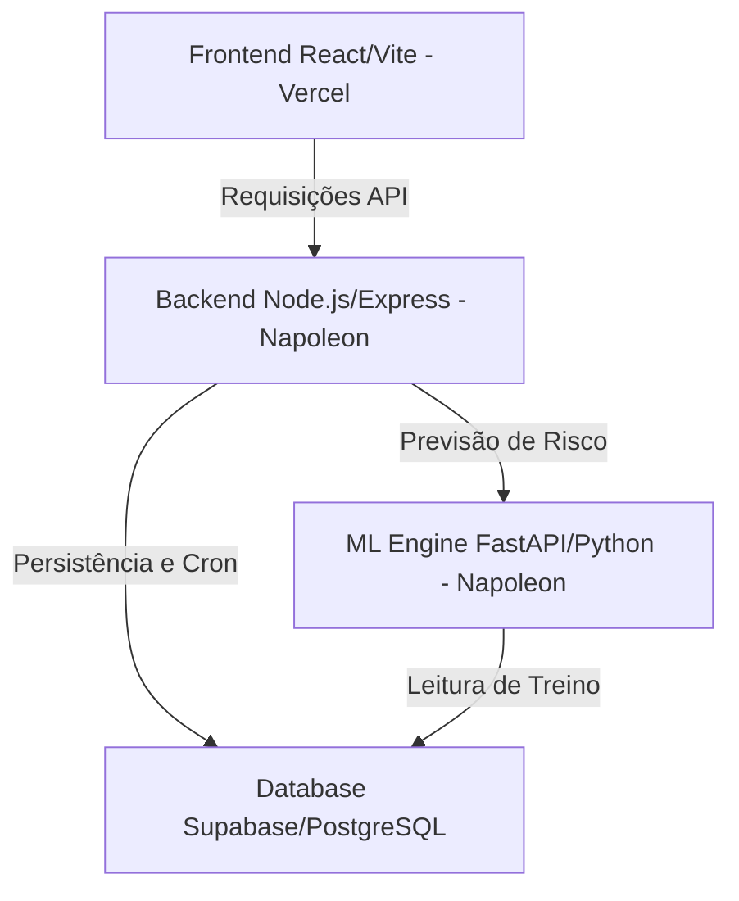

# ChurnGuard — Orquestrador Central Multiagentes 🛡️📊

O **ChurnGuard** é um ecossistema B2B completo projetado para a previsão e remediação inteligente do cancelamento de clientes (Churn). O sistema combina um modelo de Machine Learning preditivo de alta performance com um orquestrador multiagente inteligente para recomendar ações de retenção personalizadas para cada perfil de risco.

---

## 🏛️ Arquitetura do Sistema

O sistema é dividido em três camadas desacopladas e escaláveis:



1. **Frontend (React + Vite)**: Interface rica e responsiva com visualização de dados de risco, chat interativo com o agente inteligente e gerenciador de alertas.
2. **Backend (Node.js + Express)**: Orquestrador central responsável pela lógica de negócios, APIs REST, cron de varredura periódica da base e interfaceamento com o agente LLM.
3. **ML Engine (FastAPI + Python)**: Serviço de inteligência artificial contendo um pipeline do *Scikit-Learn* (Regressão Logística e normalizadores) para previsão em lote e cálculo de fatores de impacto SHAP.
4. **Banco de Dados (Supabase PostgreSQL)**: Armazenamento persistente indexado para consultas rápidas e análise em tempo real.

---

## 🛠️ Instalação e Desenvolvimento Local

### Pré-requisitos
* Node.js (versão 18 ou superior)
* Python (versão 3.10 ou superior)
* Acesso a uma instância PostgreSQL (Supabase) ou uso automático do fallback SQLite local.

### Configuração de Dependências
Na raiz do projeto, instale todas as dependências do Frontend e do Backend executando:
```bash
npm run install-all
```

Para a ML Engine (Python):
```bash
cd ml_engine
python -m venv venv
# No Windows:
venv\Scripts\activate
# No Linux/Mac:
source venv/bin/activate
pip install -r requirements.txt
```

### Variáveis de Ambiente
Crie um arquivo `.env` na raiz do projeto com base no arquivo `.env.example`:
```env
PORT=8000
ML_PORT=5000
ML_ENGINE_URL=http://127.0.0.1:5000
DATABASE_URL=seu_link_de_conexao_postgresql_supabase
GROQ_API_KEY=sua_chave_de_api_groq
```

### Inicializando o Servidor Local
Para executar todos os servidores (Frontend, Backend e ML Engine) simultaneamente em ambiente de desenvolvimento, execute na raiz do projeto:
```bash
npm run dev
```

---

## 🚀 Guia de Deploy (Produção)

Este projeto foi otimizado para deploy independente em subdomínios dedicados da **Rankia**:

### 1. Frontend (Vercel)
O frontend está configurado de forma independente na pasta `/frontend`.

* **Repositório Root**: Selecionar a pasta `/frontend`.
* **Framework Preset**: `Vite`.
* **Comando de Build**: `npm run build`.
* **Diretório de Output**: `dist`.
* **Variável de Ambiente Obrigatória**:
  * `VITE_API_URL` = `https://api-churnguard.rankia.cloud`

### 2. Backend (Napoleon Server)
O backend roda sob o subdomínio `api-churnguard.rankia.cloud`.

* **Instalação**:
  ```bash
  cd backend
  npm install --production
  ```
* **Gerenciador de Processo (PM2)**:
  ```bash
  pm2 start server.js --name "churnguard-backend"
  ```
* **Reverse Proxy Nginx**:
  ```nginx
  server {
      server_name api-churnguard.rankia.cloud;
      location / {
          proxy_pass http://127.0.0.1:8000;
          proxy_http_version 1.1;
          proxy_set_header Upgrade $http_upgrade;
          proxy_set_header Connection 'upgrade';
          proxy_set_header Host $host;
      }
  }
  ```

### 3. ML Engine (Napoleon Server)
A ML Engine roda sob o subdomínio `churnguard-ml.rankia.cloud`.

* **Instalação**:
  ```bash
  cd ml_engine
  python3 -m venv venv
  source venv/bin/activate
  pip install -r requirements.txt
  ```
* **Gerenciador de Processo (PM2 + Uvicorn)**:
  ```bash
  pm2 start "venv/bin/uvicorn main:app --host 0.0.0.0 --port 5000" --name "churnguard-ml"
  ```
* **Reverse Proxy Nginx**:
  ```nginx
  server {
      server_name churnguard-ml.rankia.cloud;
      location / {
          proxy_pass http://127.0.0.1:5000;
          proxy_http_version 1.1;
          proxy_set_header Upgrade $http_upgrade;
          proxy_set_header Connection 'upgrade';
          proxy_set_header Host $host;
      }
  }
  ```

---

## 📝 Padrões de Git Commit (Boas Práticas)

Para manter o histórico do projeto organizado e limpo, adotamos a convenção de **Conventional Commits**:

| Tipo | Descrição | Exemplo |
| :--- | :--- | :--- |
| `feat:` | Nova funcionalidade ou adição de código | `feat: adiciona link do favicon no index.html` |
| `fix:` | Correção de bugs ou problemas de build | `fix: remove dependencia local quebrada no package.json` |
| `docs:` | Mudanças apenas em documentação | `docs: adiciona instrucoes de deploy no readme` |
| `style:` | Alterações visuais, formatação de código ou CSS | `style: ajusta espaçamento dos cards de risco` |
| `refactor:` | Refatoração de código que não altera comportamento | `refactor: otimiza predict_batch na ML Engine` |
| `chore:` | Tarefas de manutenção ou dependências de pacotes | `chore: atualiza pacotes npm` |
